Apache AsterixDB&trade; strives to support an open and transparent development process. Here are the various places
where you can find discussions relating to the day to day development of AsterixDB and related projects, as well as
answers to any AsterixDB-related questions.

* TOC
{:toc }

### Mailing Lists
Most AsterixDB and Hyracks related discussion takes place on these mailing lists. To subscribe, send a blank email to the subscription address.

{:.table .table-striped .table-bordered}
| Name          | Address                                      | Subscribe Address                                      | Archives |
|---------------|----------------------------------------------|--------------------------------------------------------|----------|
| dev           | dev@asterixdb.incubator.apache.org           | dev-subscribe@asterixdb.incubator.apache.org           | [link](https://mail-archives.apache.org/mod_mbox/incubator-asterixdb-dev/)|
| users         | users@asterixdb.incubator.apache.org         | users-subscribe@asterixdb.incubator.apache.org         | [link](https://mail-archives.apache.org/mod_mbox/incubator-asterixdb-users/)|
| commits       | commits@asterixdb.incubator.apache.org       | commits-subscribe@asterixdb.incubator.apache.org       | [link](https://mail-archives.apache.org/mod_mbox/incubator-asterixdb-commits/)|
| notifications | notifications@asterixdb.incubator.apache.org | notifications-subscribe@asterixdb.incubator.apache.org | [link](https://mail-archives.apache.org/mod_mbox/incubator-asterixdb-notifications/)|

### IRC

Some of the developers hang out in #asterixdb on irc.freenode.net. Feel free to drop by with any questions.

### AsterixDB Team

#### Committers

{:.table .table-striped}
|                                                                    | Name              | Organization       | Apache ID  |
|--------------------------------------------------------------------|-------------------|--------------------|------------|
| | Abdullah Alamoudi | Couchbase          | amoudi     |
|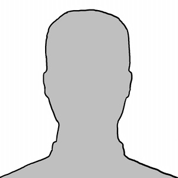         | Cameron Samak     | UC Irvine          | csamak     |
|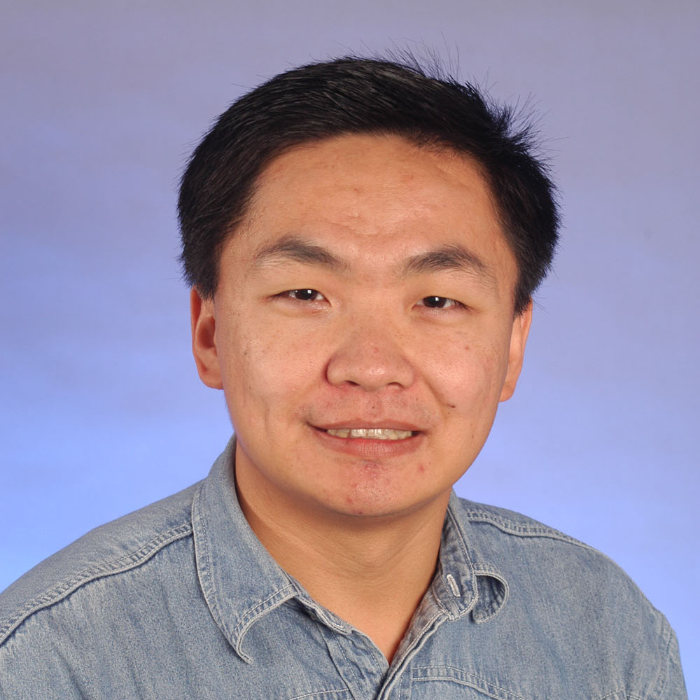           | Chen Li           | UC Irvine          | chenli     |
|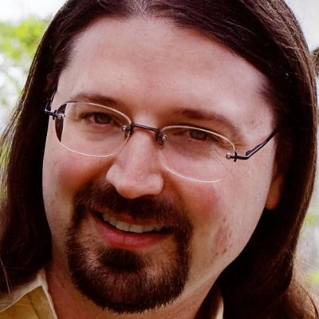     | Chris Hillery     | Couchbase          | ceej       |
|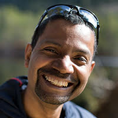   | Heri Ramampiaro   | NTNU Trondheim     | heri       |
|         | Ian Maxon         | UC Irvine          | imaxon     |
|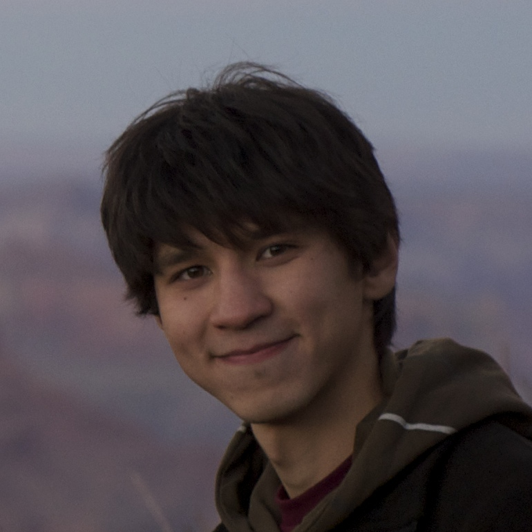  | Ildar Absalyamov  | UC Riverside       | ildar      |
|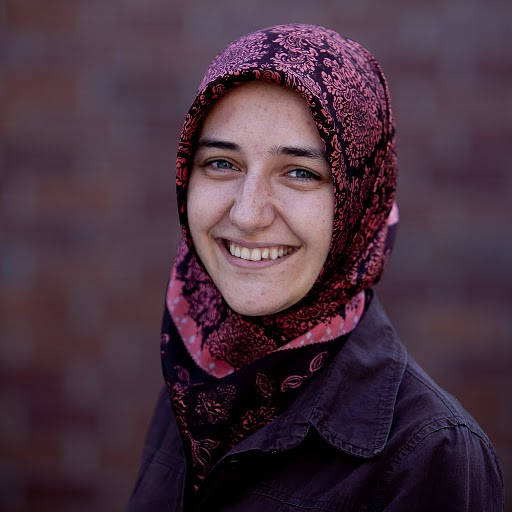     | Inci Cetindil     | UC Irvine          | icetindil  |
|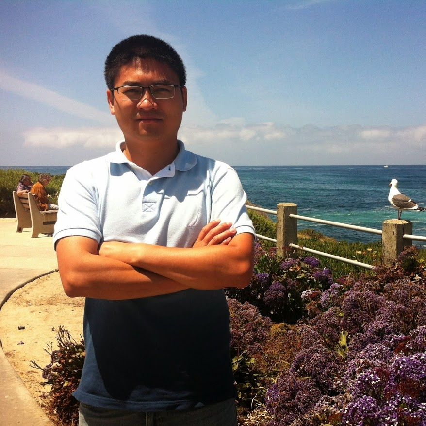      | Jianfeng Jia      | UC Irvine          | jianfeng   |
|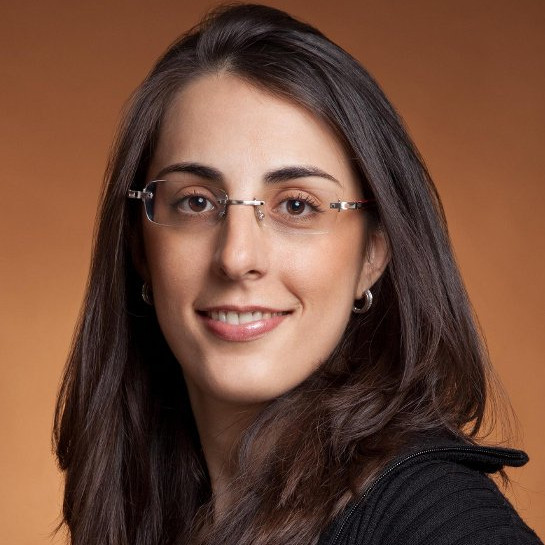    | Keren Ouaknine    | Hebrew University  | kereno     |
|         | Markus Dreseler   | HPI                | mrks       |
|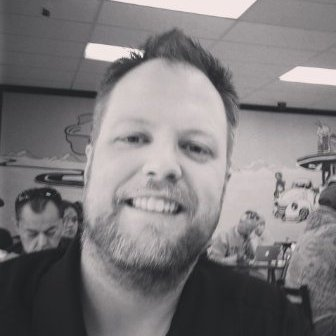      | Michael Blow      | Couchbase          | mblow      |
|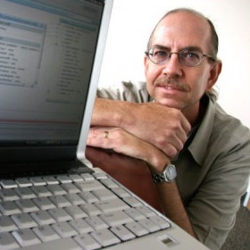     | Michael Carey     | UC Irvine          | dtabass    |
|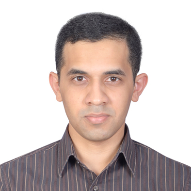   | Murtadha Hubail   | UC Irvine          | mhubail    |
|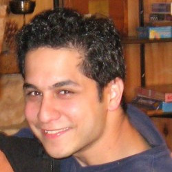   | Pouria Pirzadeh   | UC Irvine          | pouria     |
|         | Preston Carman    | UC Riverside       | prestonc   |
|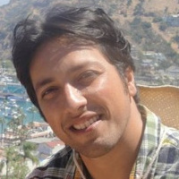      | Raman Grover      | Microsoft Research | raman      |
|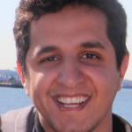  | Sattam Alsubaiee  | KACST Saudi Arabia | salsubaiee |
|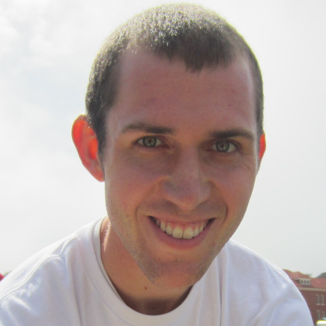     | Steven Jacobs     | UC Riverside       | sjaco002   |
|        | Taewoo Kim        | UC Irvine          | wangsaeu   |
|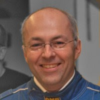     | Till Westmann     | Couchbase          | tillw      |
|  | Vassilis Tsotras  | UC Riverside       | tsotras    |
|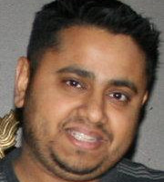    | Vinayak Borkar    | X15 Software       | vinayakb   |
|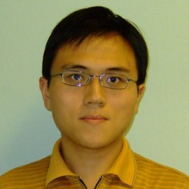         | Yingyi Bu         | Couchbase          | buyingyi   |
|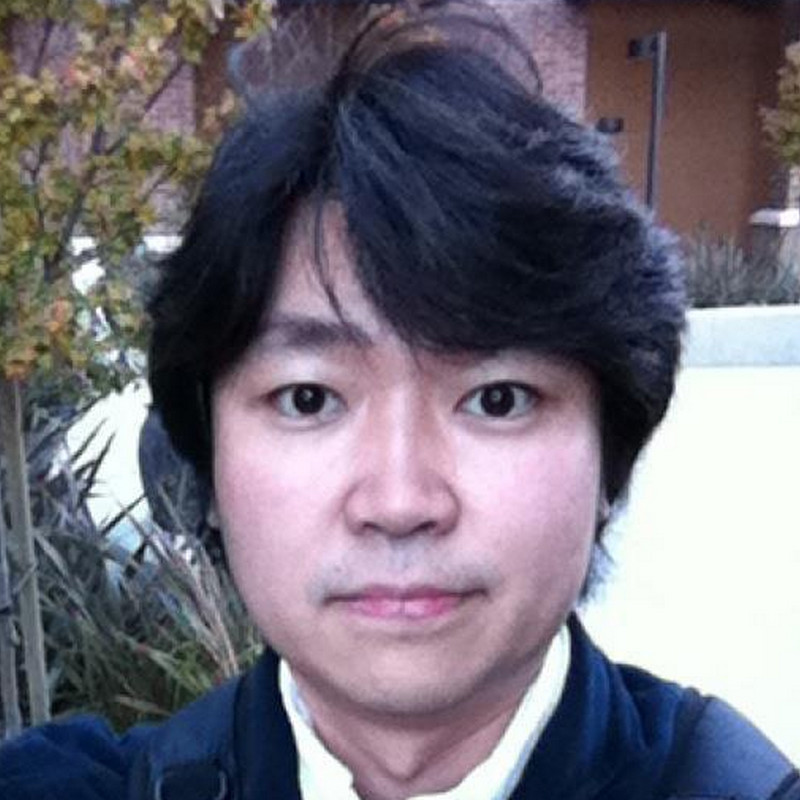    | Young-Seok Kim    | UC Irvine          | kisskys    |
|  | Zach Heilbron     | X15 Software       | zheilbron  |

#### Contributors

{:.table .table-striped}
|                                                                    | Name              | Organization       |
|--------------------------------------------------------------------|-------------------|--------------------|
|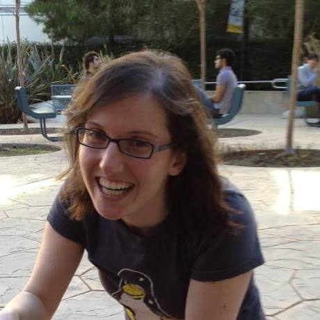| Eugenia Gabrielova| UC Irvine          |
|         | Wail Alkowaileet  | KACST Saudi Arabia |
