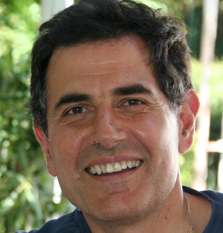
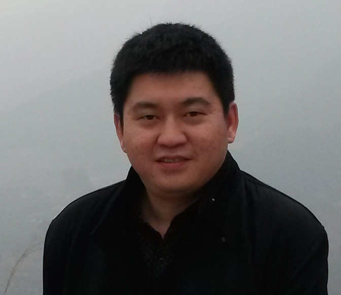

Apache AsterixDB&trade; strives to support an open and transparent development process. Here are the various places
where you can find discussions relating to the day to day development of AsterixDB and related projects, as well as
answers to any AsterixDB-related questions.

* TOC
{:toc }

### Mailing Lists
Most AsterixDB and Hyracks related discussion takes place on these mailing lists. To subscribe, send a blank email to the subscription address.

{:.table .table-striped .table-bordered}
| Name          | Address                            | Subscribe Address                            | Archives |
|---------------|------------------------------------|----------------------------------------------|----------|
| dev           | dev@asterixdb.apache.org           | dev-subscribe@asterixdb.apache.org           | [link](https://mail-archives.apache.org/mod_mbox/asterixdb-dev/)|
| users         | users@asterixdb.apache.org         | users-subscribe@asterixdb.apache.org         | [link](https://mail-archives.apache.org/mod_mbox/asterixdb-users/)|
| commits       | commits@asterixdb.apache.org       | commits-subscribe@asterixdb.apache.org       | [link](https://mail-archives.apache.org/mod_mbox/asterixdb-commits/)|
| notifications | notifications@asterixdb.apache.org | notifications-subscribe@asterixdb.apache.org | [link](https://mail-archives.apache.org/mod_mbox/asterixdb-notifications/)|

### IRC

Some of the developers hang out in #asterixdb on irc.freenode.net. Feel free to drop by with any questions.

### AsterixDB Team

#### PMC + Committers

{:.table .table-striped}
|                                                                    | Name              | Organization       | Apache ID  |
|--------------------------------------------------------------------|-------------------|--------------------|------------|
| | Abdullah Alamoudi | Couchbase          | amoudi     |
|         | Ate Douma         | Hippo              | ate        |
|         | Cameron Samak     | UC Irvine          | csamak     |
|           | Chen Li           | UC Irvine          | chenli     |
|     | Chris Hillery     | Couchbase          | ceej       |
|         | Chris Mattmann    | NASA JPL           | mattmann   |
|   | Heri Ramampiaro   | NTNU Trondheim     | heri       |
|         | Ian Maxon         | UC Irvine          | imaxon     |
|  | Ildar Absalyamov  | UC Riverside       | ildar      |
|      | Jianfeng Jia      | UC Irvine          | jianfeng   |
|    | Keren Ouaknine    | Hebrew University  | kereno     |
|      | Michael Blow      | Couchbase          | mblow      |
|     | Michael Carey     | UC Irvine          | dtabass    |
|   | Murtadha Hubail   | Couchbase          | mhubail    |
|   | Pouria Pirzadeh   | UC Irvine          | pouria     |
|         | Preston Carman    | UC Riverside       | prestonc   |
|      | Raman Grover      | Microsoft Research | raman      |
|  | Sattam Alsubaiee  | KACST Saudi Arabia | salsubaiee |
|     | Steven Jacobs     | UC Riverside       | sjaco002   |
|        | Taewoo Kim        | UC Irvine          | wangsaeu   |
|         | Ted Dunning       | MapR               | tdunning   |
|     | Till Westmann     | Couchbase          | tillw      |
|  | Vassilis Tsotras  | UC Riverside       | tsotras    |
|    | Vinayak Borkar    | X15 Software       | vinayakb   |
|         | Yingyi Bu         | Couchbase          | buyingyi   |
|    | Young-Seok Kim    | UC Irvine          | kisskys    |
|         | Xikui Wang        | UC Irvine          | xikui      |
|  | Zach Heilbron     | X15 Software       | zheilbron  |

#### Committers

{:.table .table-striped}
|                                                                    | Name              | Organization       | Apache ID  |
|--------------------------------------------------------------------|-------------------|--------------------|------------|
|         | Chen Luo          | UC Irvine          | luochen    |
|         | Dmitry Lychagin   | Couchbase          | dlych      |
|         | Wail Alkowaileet  | KACST Saudi Arabia | wyk        |
|         | Wenhai Li         | Wuhan University   | lwhay      |

#### Contributors

{:.table .table-striped}
|                                                                    | Name              | Organization       |
|--------------------------------------------------------------------|-------------------|--------------------|
|| Eugenia Gabrielova| UC Irvine          |
