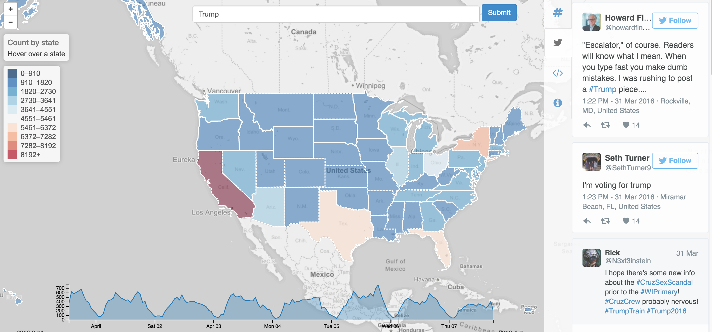

<strong>Apache AsterixDB&trade;</strong> is a scalable, open source Big Data Management System (BDMS).

 

  

### Key Features ###
* [<strong>Flexible</strong>]({{ site.DOCS_BASE_URL }}/{{ site.STABLE_VERSION }}/aql/datamodel.html) data model
* [<strong>Distributed</strong>](http://asterix.ics.uci.edu/pub/vldb14-storage.pdf) storage and transaction
* [<strong>Fast</strong>]({{ site.DOCS_BASE_URL }}/{{ site.STABLE_VERSION }}/feeds/tutorial.html) data ingestion
* [<strong>Scalable</strong>](http://asterix.ics.uci.edu/pub/ICDE11_conf_full_690.pdf), data-parallel query execution runtime
* [<strong>Declarative</strong>]({{ site.DOCS_BASE_URL }}/{{ site.STABLE_VERSION }}/aql/manual.html) query language

<strong>AsterixDB</strong> supports various storage and indexing options:

* [<strong>Managed datasets</strong>]({{ site.DOCS_BASE_URL }}/{{ site.STABLE_VERSION }}/aql/primer.html), internal LSM-based storage
* [<strong>External datasets</strong>]({{ site.DOCS_BASE_URL }}/{{ site.STABLE_VERSION }}/aql/externaldata.html), e.g., data on HDFS
* [<strong>Secondary indexes</strong>]({{ site.DOCS_BASE_URL }}/{{ site.STABLE_VERSION }}/aql/primer.html), for both storage options.

 

  

    <h3 id="flexible-data">Flexible Data</h3>
    
  

  
 
    <h3 id="architecture">Architecture</h3> 
     
  

  

  

    <h3 id="example-use-case">Example: Interactive Analytics and Visualization on Tweets</h3>
    
  

  

  <h3 id="performance-highlights">Performance Highlights</h3>

  

  

  

   	<h3 id="tech-talk">Tech Talk</h3>
     	<iframe width="100%" src="https://www.youtube.com/embed/jIZRMi9rt2E" frameborder="0" allowfullscreen></iframe>
  

  

    <h3 id="query-demo">Query Demo</h3>
    <iframe width="100%" src="https://www.youtube.com/embed/0FVipiyL-cQ" frameborder="0" allowfullscreen></iframe>
  

  

  

    <a class="twitter-timeline"  width="100%" href="https://twitter.com/ASTERIXUCI" data-widget-id="733118248380571648">Tweets by @ASTERIXUCI</a>

  

  

### Community and Support
If you have any questions, please feel free to ask on our [users](mailto:users@asterixdb.apache.org) mailing list, which you can subscribe to by sending an empty email to [users-subscribe](users-subscribe@asterixdb.apache.org). Check out the [Community]({{ site.url }}community.html) page for more details.

If you would like to know more about how to contribute to AsterixDB or any of its related components, head on over to the [Contributing]({{ site.url }}dev-setup.html) page to learn more.
  

  

### Download
   
<a class="btn btn-md btn-success" href="{{ site.STABLE_NCSERVICE_URL }}" role="button">Download AsterixDB {{ site.STABLE_VERSION }} <i class="fa fa-download fa-lg"></i></a>
      <a class="btn btn-md btn-info" href="https://github.com/apache/asterixdb/" role="button">GitHub <i class="fa fa-github fa-lg"></i></a>

   [Installation Guide]({{ site.DOCS_BASE_URL }}/{{ site.STABLE_VERSION }}/ncservice.html)

   [AsterixDB 101]({{ site.DOCS_BASE_URL }}/{{ site.STABLE_VERSION }}/sqlpp/primer.html)
  

